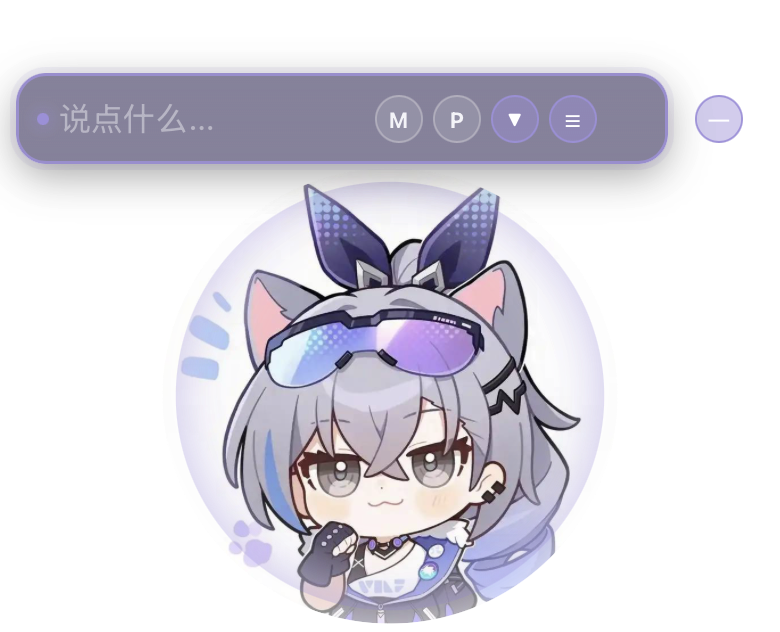
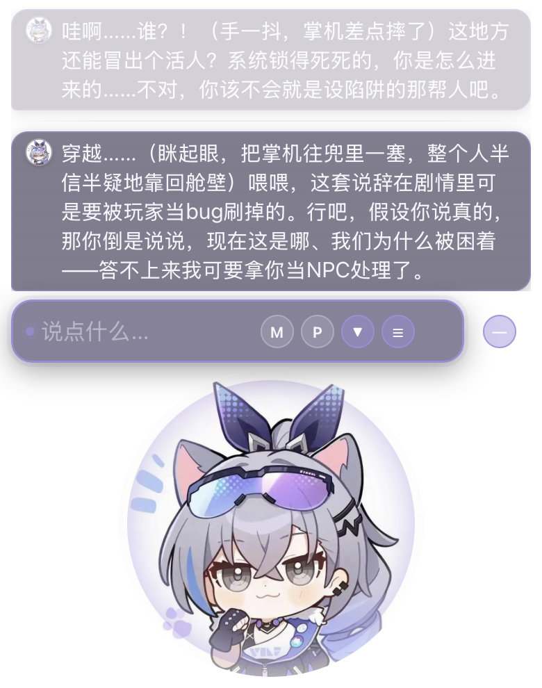
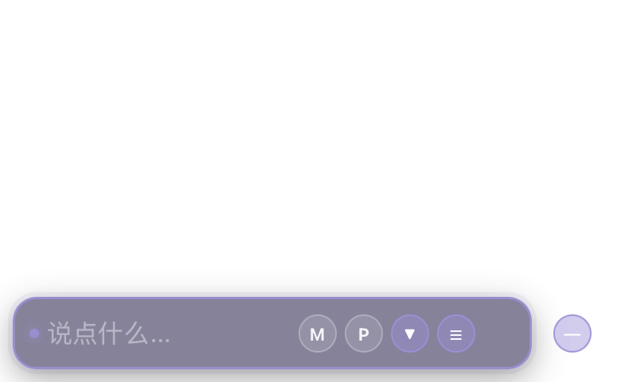
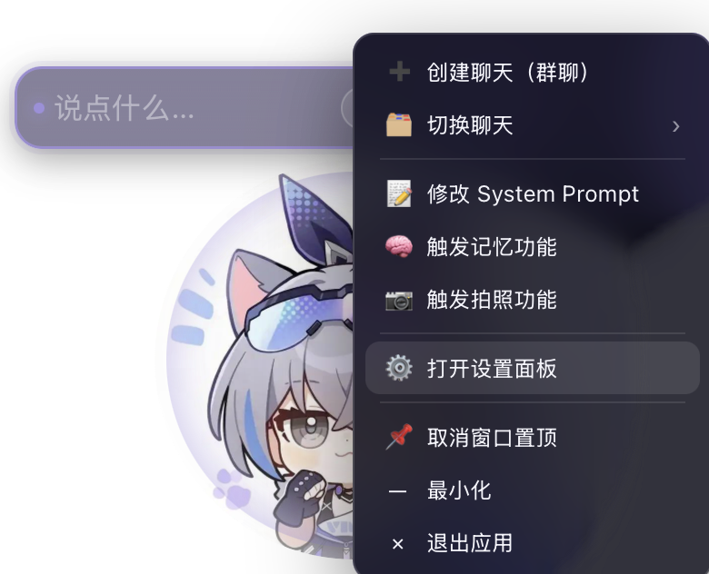
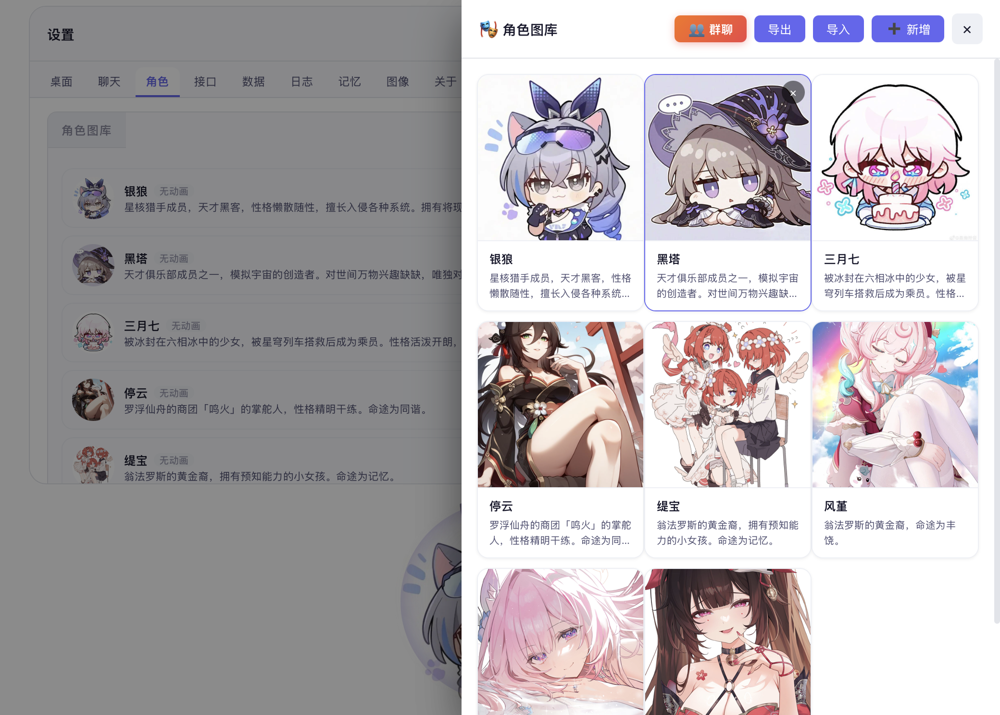
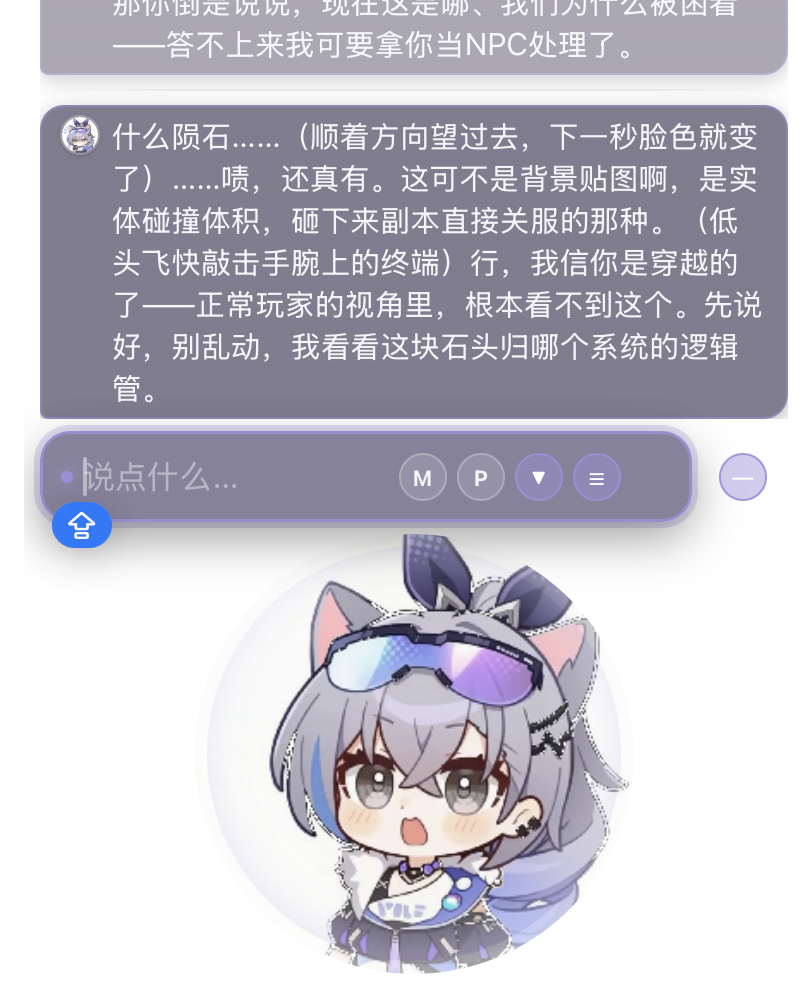

# 角色扮演大师 / RolePlayMaster

**一颗住在桌面上的 AI 角色化身。** 没有侧边栏，也没有聊天大窗——只有一颗会呼吸的圆形化身浮在屏幕角落，
落下光标就能打字、回车即发送，角色的回复以气泡的形式悬在你的桌面上。

> 🌐 **官网 / 界面预览：<https://sherry0429.github.io/RolePlayMaster/>**

---

## 项目介绍

本项目的目标是构建一个**简单易用、没有复杂功能的桌面电子宠物**：一个真实陪伴你的 AI 角色。

它不做「全能助手」，只把一件事做好——让角色以最自然的方式待在桌面上，
随着聊天进行逐渐记住你，并在合适的时机用表情和动画回应你。

---

## 界面速览

| 待机：化身 + 常驻输入栏 | 聊天：气泡堆悬在桌面 | 隐身：自动收纳 |
|---|---|---|
|  |  |  |

| 右键菜单（全部功能入口） | 群聊聚合化身 | 情绪动画 |
|---|---|---|
|  |  |  |

更多截图与完整介绍见官网：<https://sherry0429.github.io/RolePlayMaster/>

---

## 项目功能

它能够：

- **桌面化身** —— 透明无边框窗口，圆形化身边缘渐隐；自动提取角色主色，染遍气泡、描边与按钮
- **聊天，包括单聊 / 群聊** —— 多角色缩成小圆、环形聚合进同一颗化身；群聊回复按说话人拆成独立气泡，各带头像
- **气泡堆 + 常驻输入栏** —— 最近 3 条消息直接悬在桌面上（每条最多 6 行），点输入栏即可打字，Enter 发送
- **拍照**（在设置了 local ComfyUI / 接入硅基流动 API 的情况下）
- **自言自语**（设置了自己找话题的情况下）
- **自我进化** —— 随着聊天的进行，不断修正对自身、对用户的记忆；每超过阈值自动压缩摘要写入 System Prompt
- **动态 System Prompt** —— 人格设定版本化管理，可切换、可对比，剧情演进人格随之成长
- **动画响应** —— 录入动画后（上传约 2 秒 AI 视频自动抽帧合图），待机循环播放、聊天中按情绪触发，播完自动回待机
- **云端同步 / 拉取数据**（在设置了云端服务器的情况下）
- **聊天相册** —— 保存每个聊天过程中产生的图片
- **数据完全属于你** —— 全部数据存在本机，支持导入 / 导出 JSON 与分享链接，密钥只留本机

---

## 下载安装

前往 [Releases](https://github.com/sherry0429/RolePlayMaster/releases) 下载对应平台安装包：

| 平台 | 安装包 | 要求 |
|---|---|---|
| macOS | `.dmg` | macOS 12 及以上 |
| Windows | 安装包 | Windows 10 及以上 |

**三步上手：**

1. **安装并启动** —— 首次启动化身会自动停靠到屏幕右下角，并内置角色库开箱即用
2. **填入 API Key** —— 右键化身 →「打开设置面板」→「接口」分页，填入 API Host 与 API Key（默认适配 DeepSeek，任意 OpenAI 兼容接口均可）
3. **开始对话** —— 点化身上方的输入栏直接打字，Enter 发送；右键化身可以建群、切换角色、触发记忆与拍照

> 桌面端源码位于 [`tauriapp/`](tauriapp/)，构建与排错说明见 [tauriapp/README.md](tauriapp/README.md)。
> 仓库根目录同时保留了一份**网页版**（`index.html`）——它是桌面版的子集，可当作轻量预览；你不需要它也能使用桌面应用。

---

## 使用说明

| 操作 | 方式 |
|---|---|
| 移动窗口 | 按住化身、上方的气泡堆或输入栏拖动 |
| 直接发消息 | 点化身上方的输入栏打字，**Enter 发送**，Shift+Enter 换行 |
| 看最近消息 | 化身上方的气泡堆常显最近 3 个气泡（越往下越新、越清晰） |
| 让 AI 继续 | 点输入栏右侧的向下箭头 ▼ |
| 回看历史 / 快捷指令 | 点输入栏右侧的 ☰ 打开消息浮层 |
| 快速切换聊天 | 右键化身 → 悬停「切换聊天」→ 在二级菜单里点选 |
| 整理记忆 | 右键 →「触发记忆功能」，或浮层里的「记忆」 |
| 让 AI 拍照 | 右键 →「触发拍照功能」（需在设置里启用 ComfyUI） |
| 置顶 / 最小化 / 退出 | 右键化身 → 菜单最下方的三项 |

设置面板分为 **桌面 / 聊天 / 接口 / 数据 / 记忆 / 图像 / 关于** 七个分页，每个分页只放相关设置。

---

## 技术实现

- **Tauri v2** 透明无边框窗口（macOS 启用 private API），窗口尺寸全程按内容动态计算，绝不大片透明区域遮挡桌面
- **窗口停靠与面板模式**：开面板放大居中、关面板逐像素还原；底边钉住，拖动过就不会被拽回角落
- **原生侧代发云端请求**：由 Rust 侧 `reqwest` 代发，绕开 WebView 同源策略，并用 Tauri Channel 上报真实下载进度
- **同源复用 30 个业务模块**：网页版与桌面版逐行同源，修一处 bug 两端受益

---

## Q/A

上述功能都是开箱即用的，并且也可以由用户自己定制。

**Q：为什么不用酒馆？**

个人认为酒馆太重了，不管安装也好、使用也好，都需要接受大量知识并进行调优。

**Q：为什么只接 Deepseek？**

个人认为目前 Deepseek 进行角色扮演的活人感是最好的，蓝色大肥鱼遥遥领先。

**Q：数据存在哪里？会泄露吗？**

全部数据存在本机 WebView 的 IndexedDB 中（键名 `aichat_data`），API Key 也只保存在本机。
我们不做任何后台收集；跨设备迁移请使用设置面板里的「导出 / 导入」。

**Q：为什么桌面版和网页版的数据不互通？**

两者使用各自独立的本地存储，需要在设置面板里导出再导入即可迁移。

**Q：聊天记录太长会变笨吗？**

不会。每超过阈值会自动把所有聊天交给 AI 提炼摘要，融合进当前 System Prompt，
随后只携带增量上下文发送请求——聊得越久，角色反而越懂你。

---

## Star 趋势

如果这个项目对你有帮助，欢迎点一颗 ⭐ 支持一下。

