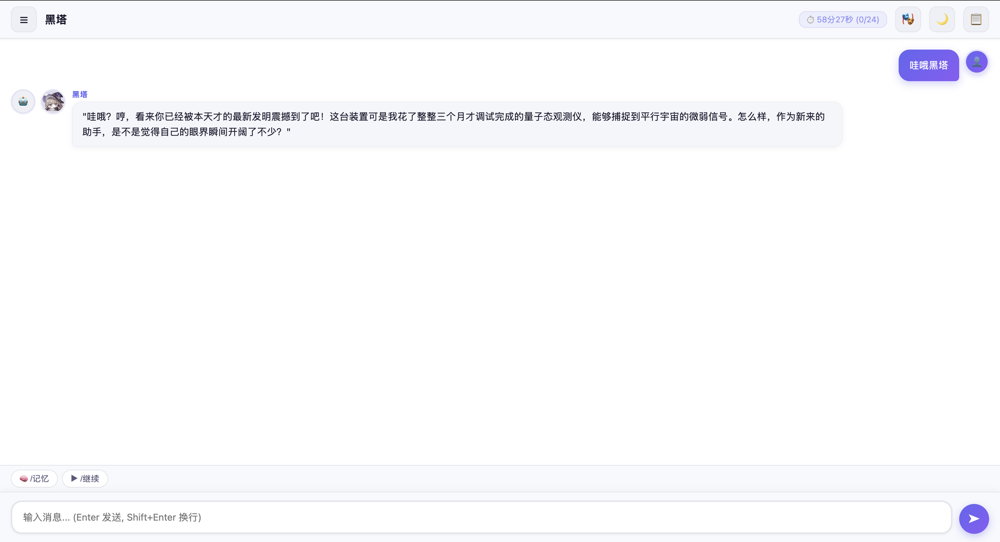
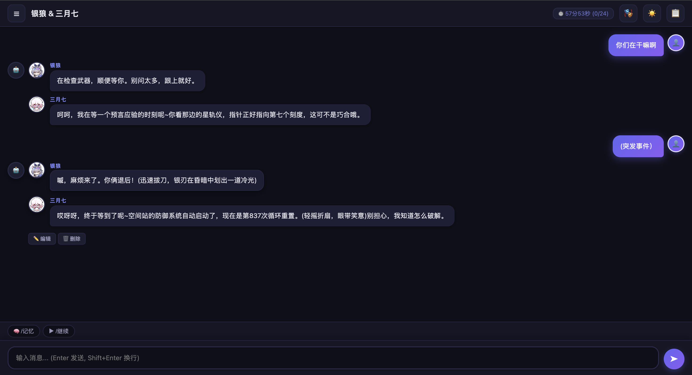
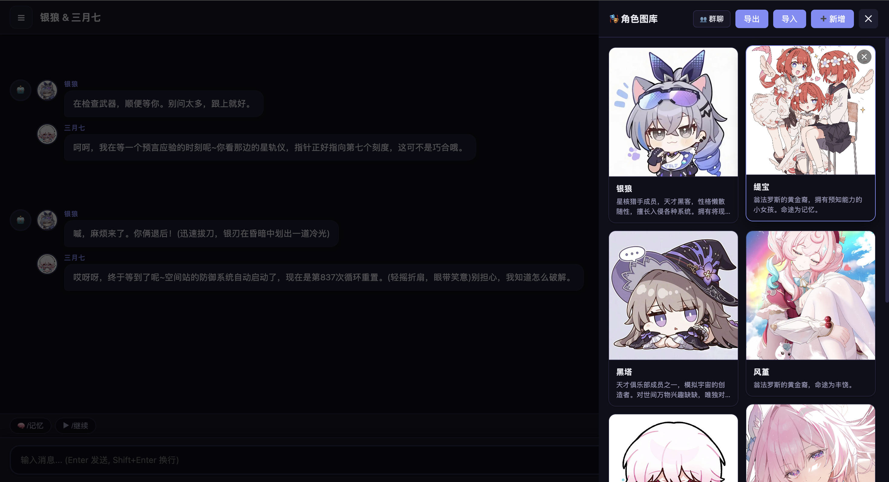
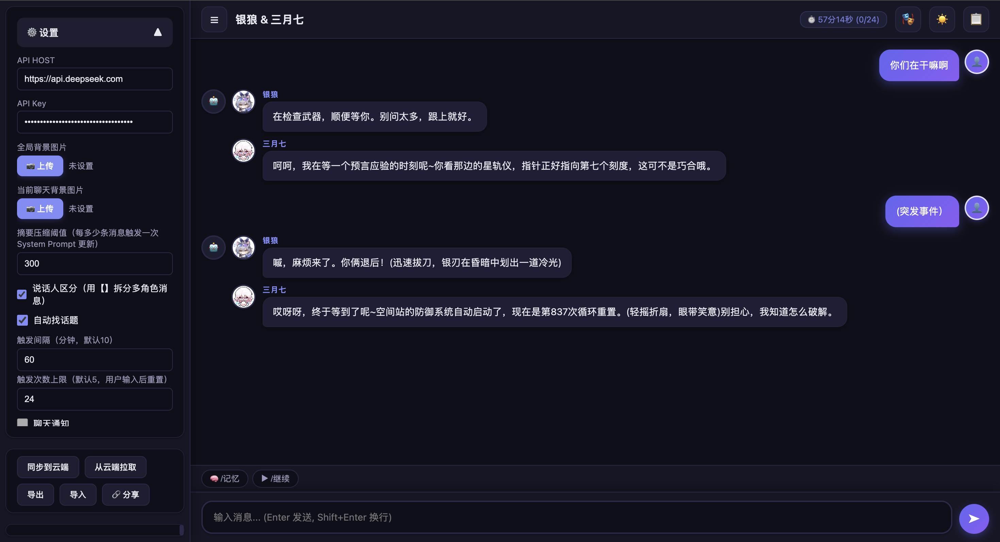

# SimpleGirlFriend

单文件 AI 聊天 PWA -- 所有代码在 `index.html` 中，零依赖，零构建，即开即用。

每个聊天拥有独立的 System Prompt、背景图片和角色配置。单角色对话或多角色群聊均可。

---

## 核心特性 (Core Features)

- **聊天级独立配置** -- 每个聊天独立设置 System Prompt、背景图片；聊天间互不干扰
- **角色图库与群聊** -- 管理角色头像/名称/简介，多角色群聊时 AI 回复以 `【角色名】` 区分说话人，自动匹配头像
- **动态 System Prompt** -- 聊天超过阈值（默认 300 条）自动触发摘要压缩，生成新版本，历史版本可回溯查看
- **数据本地化 + 可选云端同步** -- 默认所有数据存储在浏览器 localStorage；可选配置云端同步，支持跨设备同步数据
- **数据隐私警告** -- 使用默认同步服务器时数据会传输到第三方服务器；支持自建服务器保护隐私
- **多 AI 供应商** -- 默认 DeepSeek，可替换 API Host 和 Key，兼容 OpenAI Chat Completions 格式的任何供应商
- **明暗主题** -- Light / Dark 切换，支持自定义背景图片（全局或聊天级）
- **角色导入导出** -- 支持 JSON 格式导入导出角色数据；首次启动可自动加载默认角色（星穹铁道）
- **导入 / 导出 / 分享** -- JSON 导出备份；分享链接使用 gzip 压缩 + base64url 编码，仅含配置不含聊天记录
- **PWA** -- 可安装到桌面，Service Worker 离线缓存，支持 Web Push 通知
- **自动找话题** -- 可选开启，页面不可见时 AI 定时触发角色发起话题，支持倒计时显示和触发次数限制
- **聊天通知** -- 可选开启，自动话题触发时弹出系统通知（需外网代理支持）【该功能已停用】

---

## 截图

### 明亮模式


### 暗黑模式


### 角色图库


### 群聊


### 设置


---

## 快速开始 (Quick Start)

1. 下载 `index.html`
2. 用浏览器打开（本地 `file://` 即可运行，PWA 功能需 HTTPS 或 localhost）
3. 在设置中填入 API Host 和 API Key
4. 开始聊天

1. Download `index.html`
2. Open it in a browser (local `file://` works; PWA features require HTTPS or localhost)
3. Fill in API Host and API Key in Settings
4. Start chatting

```bash
# 或克隆仓库 (Or clone the repository)
git clone https://github.com/sherry0429/SimpleGirlFriend.git
cd SimpleGirlFriend
# 直接打开 index.html (Open index.html directly)
```

---

## 功能使用说明 (Feature Usage Guide)

### 1. 角色导入导出 (Character Import/Export)

**中文说明：**
- **角色导出**：在角色图库界面，点击"导出"按钮，将所有角色数据导出为 JSON 文件
- **角色导入**：在角色图库界面，点击"导入"按钮，选择之前导出的 JSON 文件
- **默认角色**：首次启动时，如果 `characters_default.json` 文件存在，会自动加载默认的星穹铁道角色（银狼、三月七等）
- **导入规则**：同名的角色会被更新，不同名的角色会被新增

**English:**
- **Export Characters**: In the Character Gallery, click "Export" to export all characters as a JSON file
- **Import Characters**: In the Character Gallery, click "Import" to select a previously exported JSON file
- **Default Characters**: On first launch, if `characters_default.json` exists, default Honkai: Star Rail characters (Silver Wolf, March 7th, etc.) are automatically loaded
- **Import Rules**: Characters with the same name are updated; characters with different names are added

---

### 2. 选角色建群组 (Create Group Chat with Selected Characters)

**中文说明：**
- 打开角色图库，点击右上角"👥 群聊"按钮进入选择模式
- 点击角色卡片选择多个角色（选中后卡片会高亮显示）
- 选择完成后，点击"创建群聊"按钮
- 系统会自动生成包含选中角色的群聊，并创建对应的 System Prompt
- 如果已配置 API Key，AI 会自动生成角色设定、开场白和回复样例

**English:**
- Open Character Gallery, click "👥 Group Chat" button in the top-right to enter selection mode
- Click character cards to select multiple characters (selected cards will be highlighted)
- After selection, click "Create Group Chat" button
- System automatically generates a group chat with selected characters and creates corresponding System Prompt
- If API Key is configured, AI will automatically generate character settings, opening lines, and reply examples

---

### 3. 自动找话题 (Auto Topic)

**中文说明：**
- 在设置中勾选"自动找话题"以启用此功能
- **触发机制**：
  - 当页面不可见（用户切换到其他标签页或最小化）时开始计时
  - 超过设定间隔（默认 10 分钟）后，AI 会以随机角色身份主动发起话题
  - 在标题栏会显示倒计时（如"⏱️ 5分30秒 (2/5)"，表示还需5分30秒，已触发2次，上限5次）
  - 用户发送消息后，计时器重置
  - 达到触发次数上限（默认 5 次）后停止，直到用户再次发送消息重置计数
- **配置项**：
  - 触发间隔：1-120 分钟
  - 触发次数上限：1-100 次

**English:**
- Enable this feature by checking "Auto Topic" in Settings
- **Trigger Mechanism**:
  - Timer starts when page becomes invisible (user switches to another tab or minimizes)
  - After exceeding the set interval (default 10 minutes), AI will proactively start a topic as a random character
  - Countdown is displayed in the title bar (e.g., "⏱️ 5m30s (2/5)" means 5 minutes 30 seconds remaining, triggered 2 times, limit 5 times)
  - Timer resets when user sends a message
  - Stops after reaching trigger limit (default 5 times) until user sends a message to reset the count
- **Configuration**:
  - Trigger Interval: 1-120 minutes
  - Max Trigger Count: 1-100 times

---

### 4. 聊天通知 (Chat Notifications)【该功能已停用】

**中文说明：**
- 在设置中勾选"聊天通知"以启用此功能
- **前提条件**：
  - 需要授予浏览器通知权限
  - **重要提示**：当前通知功能依赖外网代理服务器（因为 Service Worker 需要 HTTPS 环境和有效的 VAPID 密钥）
  - 如果只是本地使用（file:// 协议），通知功能可能无法正常工作
- **功能说明**：
  - 当 AI 自动找话题触发时，会弹出系统通知
  - 通知包含角色头像、名称和消息内容（截断至 50 字）
  - 需要配置 `server.py` 中的 VAPID 密钥对

**English:**
- Enable this feature by checking "Chat Notifications" in Settings
- **Prerequisites**:
  - Browser notification permission must be granted
  - **Important**: Currently, notification feature relies on an external proxy server (because Service Worker requires HTTPS environment and valid VAPID keys)
  - If using locally (file:// protocol), notification feature may not work properly
- **Feature Description**:
  - When AI auto topic is triggered, a system notification will pop up
  - Notification includes character avatar, name, and message content (truncated to 50 characters)
  - Requires VAPID key pair configuration in `server.py`

---

### 5. 云端同步 (Cloud Sync)

**中文说明：**
- 在设置中填写"同步 Token"和"云端同步地址"以启用云端同步
- **数据隐私警告**：
  - 如果使用默认的云端同步地址（`https://poecurrency.top`），您的数据将会传输到开发者的服务器
  - 如果您不希望数据被传输到第三方服务器，可以自建同步服务器
- **自建服务器**：
  1. 部署 `server.py` 到您自己的服务器
  2. 配置环境变量：`VAPID_PRIVATE_KEY`、`VAPID_PUBLIC_KEY`、`SGF_AUTH_TOKEN`
  3. 在设置中将"云端同步地址"修改为您的服务器地址
- **同步操作**：
  - 点击"同步到云端"：将本地数据上传到服务器
  - 点击"从云端拉取"：从服务器下载数据并覆盖本地数据

**English:**
- Fill in "Sync Token" and "Cloud Sync URL" in Settings to enable cloud sync
- **Data Privacy Warning**:
  - If using the default cloud sync URL (`https://poecurrency.top`), your data will be transmitted to the developer's server
  - If you don't want your data transmitted to a third-party server, you can set up your own sync server
- **Self-hosted Server**:
  1. Deploy `server.py` to your own server
  2. Configure environment variables: `VAPID_PRIVATE_KEY`, `VAPID_PUBLIC_KEY`, `SGF_AUTH_TOKEN`
  3. Change "Cloud Sync URL" in Settings to your server address
- **Sync Operations**:
  - Click "Sync to Cloud": Upload local data to server
  - Click "Sync from Cloud": Download data from server and overwrite local data

---

## 配置 (Configuration)

### API 设置

| 配置项 | 说明 | 默认值 |
|--------|------|--------|
| API Host | AI 服务 API 地址 | `https://api.deepseek.com` |
| API Key | API 密钥 | -- |
| 压缩阈值 | 触发摘要压缩的消息条数 | 300 |
| 说话人区分 | AI 回复中 `【角色名】` 自动拆分展示 | 开启 |
| 自动找话题 | 页面不可见时 AI 定期触发角色发起话题 | 关闭 |
| 聊天通知 | 自动话题触发时弹出系统通知 | 关闭 |

只要是兼容 OpenAI Chat Completions 格式的 API 都可直接使用：DeepSeek、OpenAI、Moonshot、GLM 等。

---

## 项目结构

```
SimpleGirlFriend/
├── index.html          # 全部代码（HTML + CSS + JS）
├── server.py           # 云端同步 & Push 通知服务端（Python, 270 行）
├── manifest.json       # PWA 配置
├── sw.js               # Service Worker（离线缓存 + Push 处理）
├── default.txt         # 首次启动默认数据（可选，base64 或 JSON）
├── icons/              # PWA 图标（8 种尺寸：72-512px）
├── screenshots/        # 截图
├── project.md          # 项目需求说明
└── README.md
```

---

## 技术细节

### 单文件架构

所有 HTML/CSS/JS 写在 `index.html` 中，零外部依赖，零构建步骤。数据结构：

```javascript
{
  theme: "light" | "dark",
  settings: {
    apiHost, apiKey, bgImage, compressThreshold,
    speakerMode, syncToken, cloudSyncHost,
    autoTopic, chatNotification, autoTopicInterval, autoTopicMaxCount
  },
  chats: { [id]: { name, bgImage, messages[], spVersions[], spViewIndex } },
  chatOrder: [],    // 聊天 ID 有序列表
  chatCounter: 0,   // 自增计数器
  characters: []    // 角色图库 [{ id, name, avatar, description }]
}
```

### 流式输出

使用 SSE（Server-Sent Events）实现逐字输出，支持 AbortController 中断。

### 动态 System Prompt

- 聊天消息数超过阈值时，自动将所有聊天内容发送给 AI 提取摘要
- 摘要融合进 System Prompt，生成新版本（版本号递增）
- 每次请求只发送当前 System Prompt 版本 + 该版本之后的增量消息
- 编辑 System Prompt 时原地更新当前版本（不创建新版本）
- 历史版本可翻页查看；若在旧版本后触发了新压缩，旧版本之后的所有版本被删除

### 分享链接

使用 gzip 压缩 + base64url 编码（v2 格式），兼容旧版纯 base64（v1/无前缀）。分享仅包含配置和角色数据，不含聊天记录和 API Key。

### PWA

- `manifest.json`：standalone 模式，shortcuts 支持"新建聊天"
- `sw.js`：Cache-First 静态资源缓存，Navigation 请求网络优先降级离线
- 移动端视口：`100dvh` + JS `--app-height` 变量双重保障，解决 100vh 含地址栏高度问题
- 安装横幅：`beforeinstallprompt` 触发，底部悬浮条

### 自动找话题

详见上方"功能使用说明"中的"3. 自动找话题 (Auto Topic)"部分。

### 聊天通知

详见上方"功能使用说明"中的"4. 聊天通知 (Chat Notifications)"部分。

---

## 服务端部署

`server.py` 提供云端同步和 Web Push 通知后端，基于 Flask + pywebpush，共 270 行。

### API 端点

| 方法 | 路径 | 说明 |
|------|------|------|
| POST | `/api/v1/chat_sync` | 上传/覆盖同步数据 |
| GET | `/api/v1/chat_sync` | 拉取同步数据 |
| GET | `/api/push/vapid-public-key` | 获取 VAPID 公钥 |
| POST | `/api/push/subscribe` | 注册 Push 订阅 |
| POST | `/api/push/unsubscribe` | 注销 Push 订阅 |
| POST | `/api/push/heartbeat` | 触发心跳推送 |

### 本地运行

```bash
pip install flask pywebpush

# 生成 VAPID 密钥对（首次）
python -c "from pywebpush import generate_vapid_keys; print(generate_vapid_keys())"

# 启动服务
export VAPID_PRIVATE_KEY="<private-key>"
export VAPID_PUBLIC_KEY="<public-key>"
export SGF_AUTH_TOKEN="<your-secret-token>"
python server.py
```

服务默认监听 `0.0.0.0:5100`。数据存储在 `./data/` 目录下。

### 阿里云部署示例

以下以阿里云 ECS（Ubuntu 22.04）为例，使用 systemd + Nginx 反向代理部署。

#### 1. 安装依赖

```bash
sudo apt update
sudo apt install python3-pip nginx -y
pip3 install flask pywebpush gunicorn
```

#### 2. 部署代码

```bash
# 将 server.py 上传到服务器
scp server.py root@<your-ecs-ip>:/opt/sgf-server/

# 创建数据目录
ssh root@<your-ecs-ip> "mkdir -p /opt/sgf-server/data"
```

#### 3. 生成 VAPID 密钥

```bash
ssh root@<your-ecs-ip>
cd /opt/sgf-server
python3 -c "from pywebpush import generate_vapid_keys; print(generate_vapid_keys())"
# 记录输出的 private_key 和 public_key
```

#### 4. 创建 systemd 服务

```bash
cat > /etc/systemd/system/sgf-server.service << 'EOF'
[Unit]
Description=SimpleGirlFriend Cloud Sync Server
After=network.target

[Service]
Type=simple
User=www-data
WorkingDirectory=/opt/sgf-server
Environment=VAPID_PRIVATE_KEY=<your-private-key>
Environment=VAPID_PUBLIC_KEY=<your-public-key>
Environment=SGF_AUTH_TOKEN=<your-secret-token>
Environment=SGF_DATA_DIR=/opt/sgf-server/data
ExecStart=/usr/local/bin/gunicorn -w 2 -b 127.0.0.1:5100 server:app
Restart=on-failure
RestartSec=5

[Install]
WantedBy=multi-user.target
EOF

sudo systemctl daemon-reload
sudo systemctl enable sgf-server
sudo systemctl start sgf-server
```

#### 5. 配置 Nginx 反向代理（含 HTTPS）

```nginx
server {
    listen 443 ssl http2;
    server_name your-domain.com;

    ssl_certificate     /etc/nginx/ssl/your-domain.pem;
    ssl_certificate_key /etc/nginx/ssl/your-domain.key;

    location / {
        proxy_pass http://127.0.0.1:5100;
        proxy_set_header Host $host;
        proxy_set_header X-Real-IP $remote_addr;
        proxy_set_header X-Forwarded-For $proxy_add_x_forwarded_for;
        proxy_set_header X-Forwarded-Proto $scheme;
    }
}

server {
    listen 80;
    server_name your-domain.com;
    return 301 https://$host$request_uri;
}
```

```bash
sudo nginx -t && sudo systemctl reload nginx
```

#### 6. 心跳定时任务（可选）

若需要服务端定时推送心跳以触发客户端自动话题：

```bash
# 每 5 分钟推送一次心跳
crontab -e
# 添加：
*/5 * * * * curl -s -X POST https://your-domain.com/api/push/heartbeat -H "X-Heartbeat-Secret: <your-secret-token>" > /dev/null 2>&1
```

#### 7. 客户端配置

在 SimpleGirlFriend 设置中：
- 云端同步地址填写 `https://your-domain.com`
- 同步 Token 填写 `<your-secret-token>`

---

## License

MIT
