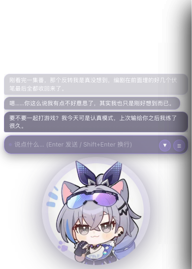
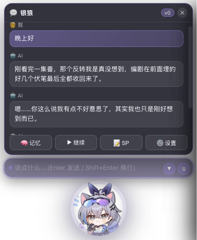
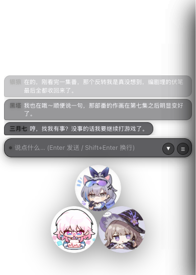
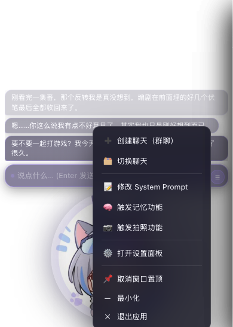
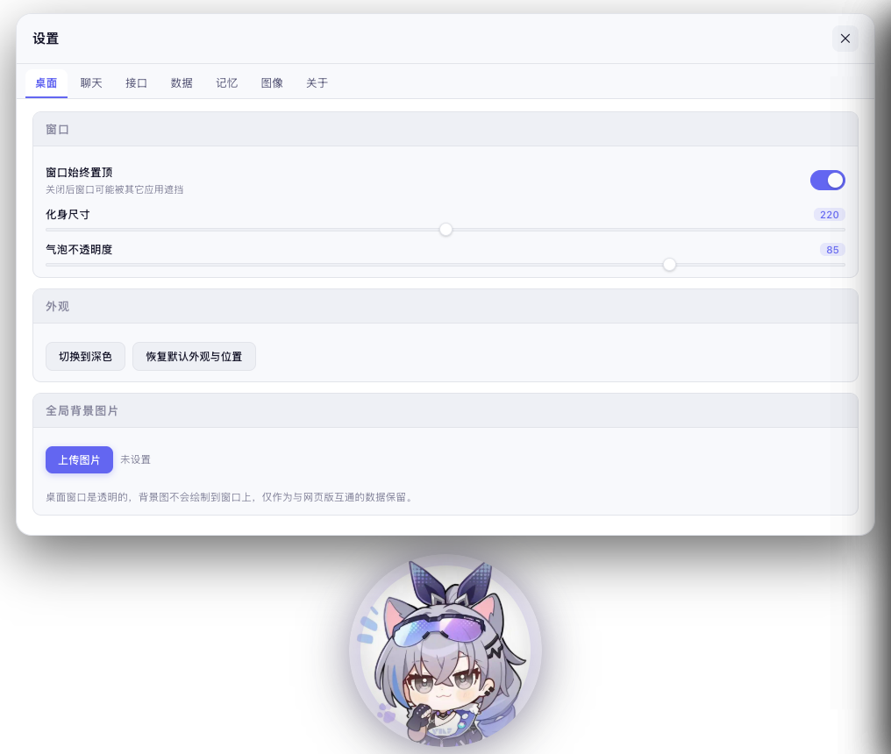
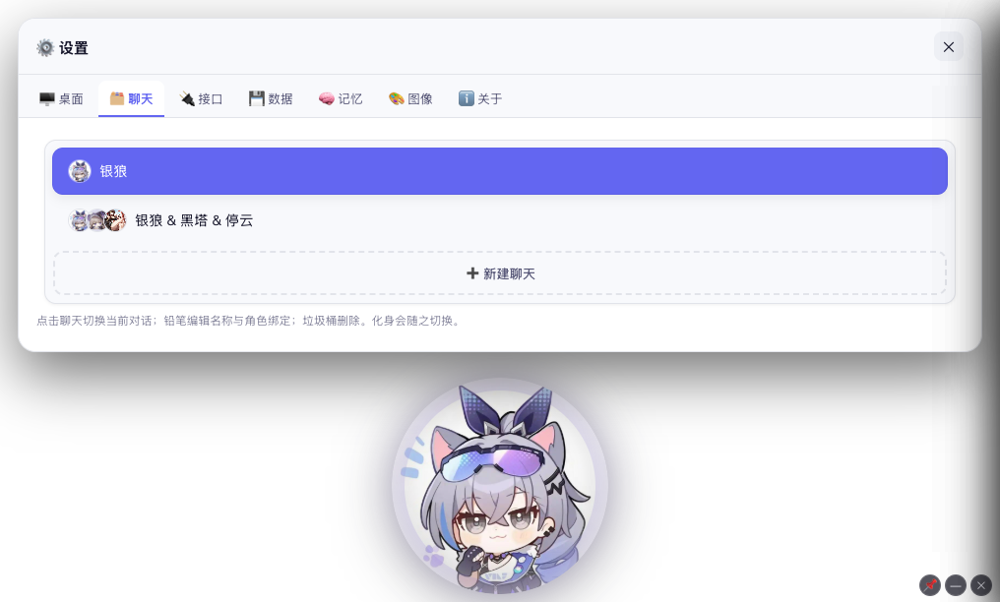
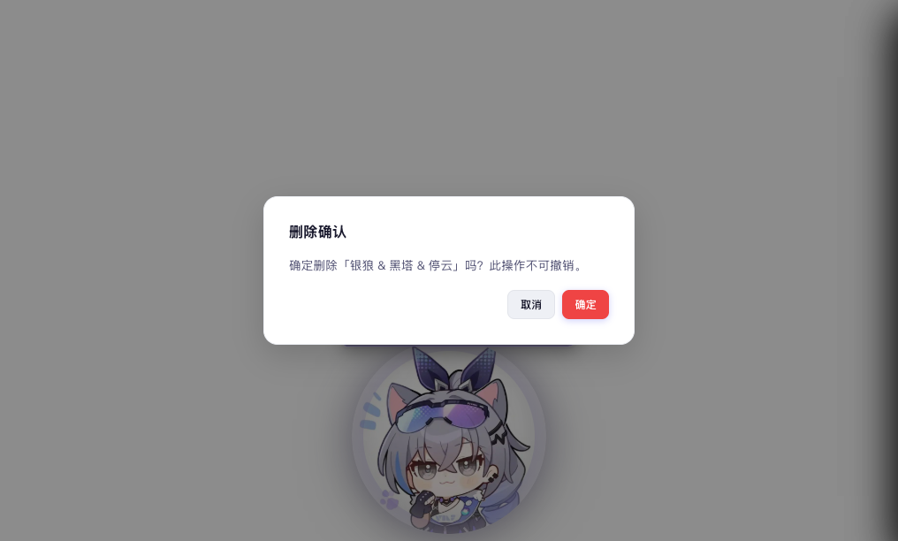
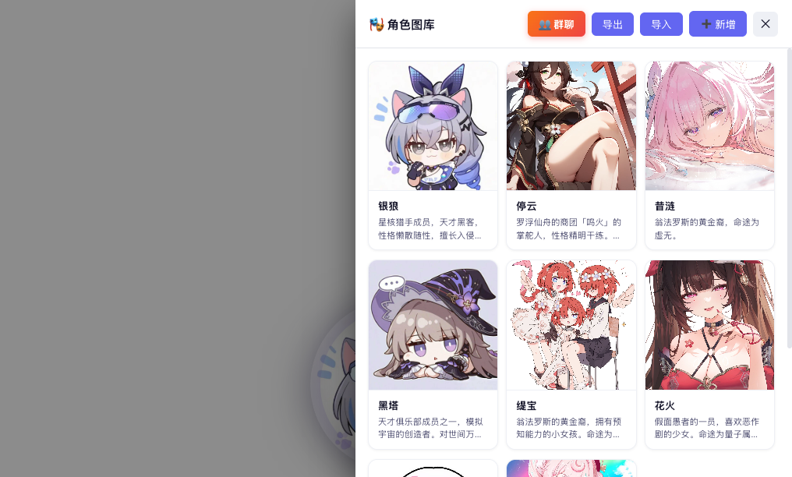

# RolePlayMaster · 桌面化身版（Tauri）

把网页版 AI 聊天应用改造成一个**桌面化身**应用：没有聊天窗口，只有一颗会呼吸的圆形角色头像（化身）浮在桌面上，
化身上方直接悬着最近的消息与输入栏，落下光标就能打字、回车即发送。

---

## 一、和网页版有什么不同

| | 网页版 | 桌面化身版 |
|---|---|---|
| 界面形态 | 侧边栏 + 聊天区 + 顶栏 | **透明无边框窗口**，只有圆形化身 |
| 角色呈现 | 聊天气泡里的头像 | **圆形化身**，边缘越靠外越透明，逐渐淡出（气泡感） |
| 多角色 | 一条消息里分段 | 每个角色缩小成小圆，**聚合成一个大圆**，整体不超出原大小 |
| 最近消息 | 聊天区里往上翻 | 化身上方的**消息气泡堆**：最近 3 个气泡直接悬在桌面上（每条最多 6 行） |
| 输入 | 聊天区底部输入框 | 化身上方的**常驻输入栏**，落下光标就能打字，**回车即发送**，无需先点开聊天窗 |
| 查看历史 / 快捷指令 | 侧边栏 / 顶栏按钮 | 输入栏右侧的 **☰** 打开消息浮层（最近 5 条 + 记忆/继续/拍照/SP/设置） |
| 继续 | 「▶ /继续」按钮 | 输入栏右侧的同色向下箭头 **▼** |
| 功能入口 | 侧边栏 / 顶栏按钮 | **右键化身**弹出的菜单 |
| 重放 | 有 | **移除**（按需求） |
| 系统通知 | Web Push | 移除（桌面版不需要） |
| 云端同步 | 直连接口（同源） | **由原生侧代发**，绕开 WebView 的同源策略（见「五、实现要点 5」） |

右键菜单包含：

1. 创建聊天（群聊）
2. 切换聊天
3. 修改 System Prompt（含版本切换）
4. 触发记忆功能
5. 触发拍照功能
6. 打开设置面板
7. 窗口置顶（带勾选态）/ 最小化 / 退出应用
   —— 原先浮在化身右上角的三个按钮已收进菜单，画面上不再有任何常驻控件

设置面板里保留了网页版的全部设置项（API HOST / API Key / 背景图 / 压缩阈值 / 说话人区分 / 自动找话题 /
同步 Token / 云端地址 / ComfyUI 全套参数），并额外提供：同步到云端、从云端同步、导入、导出、分享、
主题切换、查看日志、当前聊天相册、角色管理、创建群聊、切换当前聊天，以及桌面专属的**窗口置顶 / 化身尺寸 /
气泡不透明度**。

---

## 界面速览

| 收起态：气泡堆 + 输入栏 + 化身 | 点 ☰ 展开的消息浮层 |
|---|---|
|  |  |

> 气泡堆自上而下依次是**更旧→更新**的内容，透明度也随之下调（最上面最淡，越往下越清晰）。
> 只保留 3 个是为了让每条能展开到 6 行——宁可少看几条，也要把内容看全。

**气泡的粒度跟随设置里的「说话人区分」**：

| 说话人区分 | 气泡粒度 |
|---|---|
| 开启（默认） | **一个气泡 = 一个说话人的一段话**。群聊里 AI 一条回复含 `【A】…【B】…【C】…` 时会拆成 3 个气泡，各自带自己的名字与配色 |
| 关闭 | 一条 AI 消息 = 一个气泡，`【角色名】` 原样留在正文里 |

这样群聊里每个角色的发言都是独立一颗气泡，和网页版里「按说话人分段」的呈现方式一致。

| 群聊聚合化身（黑色描边） | 右键菜单 |
|---|---|
|  |  |

| 设置面板 · 桌面分页（面板打开时化身仍可见、可拖动） | 设置面板 · 聊天分页 |
|---|---|
|  |  |

| 应用内确认框 | 角色管理 |
|---|---|
|  |  |

> 截图取自浏览器降级预览（窗口背景为透明，截图中呈现为白色）；
> 桌面端的实际窗口尺寸会随状态变化，详见下一节。

---

## 二、目录结构

```
tauriapp/
├── package.json                     # 仅用于拉起 @tauri-apps/cli
├── src/                             # 前端（无需构建，Tauri 直接内嵌）
│   ├── index.html                   # 外壳骨架：气泡堆 / 输入栏 / 化身 / 右键菜单 / 面板 / 兼容节点
│   ├── characters_default.json      # 内置角色库（首次启动自动导入）
│   ├── css/
│   │   ├── legacy.css               # 直接复用网页版样式表（面板、抽屉、模态框、变量）
│   │   ├── theme.css                # 透明窗口基线 + 桌面专属变量
│   │   ├── shell.css                # 气泡堆 / 输入栏 / 化身 / 消息浮层 / 右键菜单
│   │   └── panels.css               # 设置与 SP 面板、抽屉的桌面适配
│   └── js/
│       ├── core/                    # 从网页版原样移植的 30 个业务模块
│       │   ├── MAP.md               #   与网页版模块的逐项对照表
│       │   └── 00_prompts.js … 29_album.js
│       └── shell/                   # 桌面外壳（新增）
│           ├── 00_tauri.js          # Tauri 桥：拖拽 / 置顶 / 最小化 / 面板模式 / 文件读写
│           ├── 01_avatar.js         # 化身渲染、主色提取、多角色布局
│           ├── 02_bubble.js         # 消息气泡堆（最近 3 个，按说话人拆分）+ 输入栏 + 消息浮层
│           ├── 03_menu.js           # 右键菜单与全局拖拽手柄
│           ├── 04_panels.js         # 面板层、设置分页、窗口尺寸贴合内容
│           ├── 05_overrides.js      # 网页版逻辑 → 桌面外壳的适配层
│           ├── 06_cloud.js          # 云端同步传输层（原生代发，绕开 WebView 跨域限制）
│           ├── 07_dialogs.js        # 应用内确认框（替代 Tauri 不支持的 window.confirm）
│           └── 08_boot.js           # 启动流程
├── screenshots/                     # 界面截图
└── src-tauri/                       # Rust 后端
    ├── Cargo.toml / Cargo.lock
    ├── build.rs
    ├── tauri.conf.json              # 透明无边框窗口、macOS private API、图标
    ├── capabilities/default.json
    ├── icons/
    └── src/{main.rs, lib.rs}        # 托盘、窗口停靠、原生文件对话框、云端请求代发
```

### 设计思路：复用而不是重写

网页版的 38 个 JS 模块里，**30 个业务模块被原样复用**（`js/core/`，仅改文件名），
包括流式请求、记忆压缩、拍照、相册、群聊初始化、云端同步、ComfyUI、导入导出、日志等全部逻辑。
只跳过 4 类确实不适用于桌面的模块：初始化（改写启动流程）、PWA、重放、移动端侧边栏。
文件名与网页版模块的逐项对应关系见 [`src/js/core/MAP.md`](src/js/core/MAP.md)。

`js/shell/05_overrides.js` 是唯一的适配层，它只做三件事：

1. 补上被移除模块遗留的全局符号（`isReplaying` / `stopReplay` / `closeSidebar` …）；
2. 把「渲染到聊天区 DOM」的 4 个函数换成化身气泡版渲染
   （`renderMessages` / `scrollToBottom` / `updateStreamingMessage` / `applyBgImage`）；
3. 把依赖浏览器下载行为的导入导出换成原生文件对话框。

因此网页版与桌面版的功能是**逐行同源**的，后续在网页版修 bug 时，把对应 `core/` 文件覆盖过来即可。

---

## 三、构建与运行

### 环境要求

- Node.js ≥ 18（用于 `@tauri-apps/cli`）
- Rust ≥ 1.77（`rustup` 安装）
- macOS 需要 Xcode Command Line Tools：`xcode-select --install`
- 首次构建需要联网下载 Rust 依赖（Tauri 全套约 400 个 crate）

### 命令

```bash
cd tauriapp

# 安装 Tauri CLI（仅一次）
npm install

# 开发模式（热更新前端，改 src/ 下的文件立即生效）
npm run dev

# 打包出 .app / .dmg
npm run build
```

打包产物位置：`src-tauri/target/release/bundle/macos/RolePlayMaster.app`，
安装包在同级 `dmg/` 目录下。

> **本项目已实测通过编译。** 当前锁定的依赖为 Tauri `2.11.6` / Rust `1.95`，
> `Cargo.lock` 已一并提交以保证依赖可复现。
> 仓库里已存在的调试版二进制可直接启动（无需打包）：
> ```bash
> ./src-tauri/target/debug/roleplay-master
> ```

### 只想看界面？

前端不依赖任何构建步骤，直接起个静态服务器即可在浏览器里预览（窗口相关能力会自动降级）：

```bash
npm run serve      # 等价于 python3 -m http.server 8777 --directory src
# 然后打开 http://127.0.0.1:8777/
```

---

## 四、使用说明

### 首次启动

1. 应用会把自己停靠到**屏幕右下角**（Dock 里保留图标，菜单栏也有托盘图标）。
2. 首次启动会自动导入内置角色库（`characters_default.json`，8 个角色）。
3. 右键化身 →「创建聊天（群聊）」→ 勾选角色 →「确认建群」，即可开始。

### 常用操作

| 操作 | 方式 |
|---|---|
| 移动窗口 | 按住化身、上方的气泡堆或输入栏拖动 |
| 直接发消息 | 点化身上方的输入栏打字，**Enter 发送**，Shift+Enter 换行 |
| 看最近消息 | 化身上方的气泡堆常显最近 3 个气泡（越往下越新、越清晰；开启说话人区分时，一个气泡 = 一个说话人的一段话） |
| 让 AI 继续 | 点输入栏右侧的向下箭头 ▼ |
| 回看历史 / 快捷指令 | 点输入栏右侧的 ☰ 打开消息浮层 |
| 打开菜单 | 右键化身（或右键输入栏） |
| 让 AI 拍照 | 右键 →「触发拍照功能」（需在设置里启用 ComfyUI） |
| 整理记忆 | 右键 →「触发记忆功能」，或浮层里的「🧠 记忆」 |
| 置顶 / 最小化 / 退出 | 右键化身 → 菜单最下方的三项（退出前会弹应用内确认框） |

### 数据存储

所有数据存在 WebView 的 IndexedDB 中（键名 `aichat_data`），与网页版结构完全一致，
但**与浏览器不共享**。要在两者之间迁移，用设置面板的「导出 / 导入」即可。

---

## 五、实现要点

### 1. 透明窗口

`tauri.conf.json`：`transparent: true` + `decorations: false` + `shadow: false`；
macOS 还需要 `app.macOSPrivateApi: true`（已在配置里打开，Cargo.toml 也启用了 `macos-private-api` 特性）。

### 2. 窗口尺寸随内容变化

桌面挂件最忌讳「一大片透明区域挡住后面的应用」，所以窗口尺寸是动态的：

- 收起态：高度 = 气泡堆 + 输入栏 + 化身，紧贴内容；
- 展开消息浮层：化身缩到 50%，浮层占据上方空间；
- 打开设置 / 相册 / 日志：窗口放大到屏幕的 ~82%×88% 并居中（**面板模式**），关闭后还原并重新停靠右下角。

高度**不能**直接量 DOM 的实时高度：化身的宽高带 CSS 过渡，展开/收起瞬间量到的是过渡中的旧尺寸，
窗口就会差出整整一个化身的高度。所以按已知量解析计算（气泡堆高度 + 输入栏高度 + 化身的**目标**高度），
并在展开/收起时临时关掉化身过渡（`holdAvatarSize()`），保证两者同步变化。

另外，**面板模式下面板层必须独占窗口**：此时气泡堆与输入栏要 `display: none` 而不是只调透明度。
只调透明度它们仍然占着几百像素的布局高度，面板层会被挤扁，`fitPanelWindow` 又按被挤扁的结果
去收窗口，越收越小，最后设置面板只剩一条边。

### 3. 化身主色提取

`computeDominantColor()` 把角色图片绘制到 32×32 的 canvas，做 4bit 量化统计直方图，
并做三项加权：中心像素权重更高、极端明暗像素降权、低饱和像素降权，
最后把结果转到 HSL 并抬升饱和度/亮度，作为气泡堆、输入栏描边、箭头与按钮的 `--accent-rgb`。

多角色时按需求固定使用**黑色**描边。

### 4. 多角色聚合

`layoutMulti(n)` 用环形分布把一个/两/三/四/五/六个小圆排进同一个大圆：

| 角色数 | 排布 |
|---|---|
| 2 | 左右并排 |
| 3 | 一个在上、两个在下 |
| 4 | 田字格 |
| 5 / 6 | 五边形 / 六边形环 |
| > 6 | 展示前 6 个，右下角显示「共 N 人」 |

每个小圆自身有轻微渐隐，容器再套一层径向遮罩，整组头像一起向外淡出。

### 5. 云端同步绕开 WebView 的跨域限制

这是移植过程中踩到最深的一个坑，值得单独说明。

桌面端 WebView 的来源是 `tauri://localhost`，而云端接口默认在 `https://poecurrency.top`
——两者**不同源**。带 `Authorization` 头的请求会先触发 CORS 预检（`OPTIONS`），
而该服务端既不处理预检（`OPTIONS` 被当成普通请求，返回 `401 missing Authorization header`），
也不返回任何 `Access-Control-Allow-Origin` 头，于是 WebView 内核直接拦截请求，
前端只能拿到 `xhr.onerror` ——表现为「**网络错误，请检查云端地址是否可访问**」。

网页版之所以一切正常，是因为它部署在同一台服务器上，与接口同源，根本不涉及跨域。

**解决办法**：把这两个接口交给原生侧代发（`lib.rs` 的 `cloud_get` / `cloud_post`）。
原生请求不受同源策略约束，并且可以顺带用 Tauri 的 `Channel` 按块上报真实下载进度：

```
syncFromCloud / syncToCloud  (core/25_group.js)
        └─ cloudRequest()          (shell/06_cloud.js)
              ├─ 桌面端 → invoke('cloud_get' / 'cloud_post') → reqwest  → poecurrency.top
              └─ 浏览器预览 → fetch()（受同源策略限制，仅供调试）
```

HTTP 客户端用 `reqwest` + `native-tls`（macOS 走系统 `Security.framework`），
避免引入 rustls/aws-lc 那套需要额外 C 工具链的依赖。

> 顺带说明：`27_autotopic.js` 里的 Web Push 订阅接口（`/api/push/*`）同样会跨域，
> 但它依赖 Service Worker，桌面端不会触发，所以未改。

---

## 六、窗口与面板行为

桌面挂件最容易踩的坑是「窗口要么盖住整个桌面、要么跑出屏幕」，所以窗口尺寸与位置是全程动态计算的：

| 状态 | 窗口如何变化 |
|---|---|
| 收起（气泡堆 + 输入栏 + 化身） | 紧贴内容：`气泡堆 + 6 + 输入栏 + 6 + 化身尺寸 + 14`，**上限 = 屏幕工作区高度** |
| 展开消息浮层 | 化身缩到 50%、气泡堆让位，窗口给浮层留 300px |
| 打开设置 / SP 面板 | 先放大居中，再按**面板实际内容高度**收紧（贴合内容，不留大片空白）；化身保留在下方可见 |
| 打开抽屉（角色 / 相册 / 日志） | 放大到屏幕 82%×88% 并居中 |
| 全部关闭 | 还原到打开面板前的**尺寸与位置**，逐像素一致 |

**位置策略：拖动过就不会被拽回去。** 窗口尺寸变化时只把「底边」钉住 ——
变高就向上长、变矮就向下收，横向一动不动。所以把化身拖到屏幕任意角落，
点 ☰ 打开聊天窗时浮层就出现在那颗化身正上方，而不是弹回右下角。
打开设置面板前会记住当时的尺寸与位置，关闭后原样还原。

**气泡堆不会被截断。** 它的高度上限 = 屏幕工作区扣掉「输入栏 + 化身 + 内边距」之后的**全部**剩余空间，
而 3 个气泡最多也就 6 行 × 3 ≈ 330px，所以在常见屏幕上永远放得下，顶部那条不会被吃掉。

> 实测（工作区 843px 高、3 条 6 行消息）：气泡堆上限 558px、窗口 **390×547**，`clipped=false`。

所有尺寸都会先**夹到屏幕工作区内**，定位用的是「本次请求的目标尺寸」而不是窗口当前尺寸——
后者在改尺寸后可能尚未更新，会把窗口顶出屏幕。

**拖窗口**：按住化身、消息气泡堆、消息浮层顶栏、面板标题栏或抽屉标题栏都可以拖动（这些区域都标了 `data-drag`）。

**窗口操作**全部收在右键菜单最下方（画面上不再有任何常驻按钮）：

- 📌 窗口置顶 —— 文案随状态变化（「窗口置顶」/「取消窗口置顶」），当前已置顶时带勾选标记
- — 最小化（应用保留 Dock 图标，点 Dock 图标即可恢复）
- ✕ 退出应用（先弹应用内确认框，避免误触）

**设置面板分为 7 个分页**：桌面 / 聊天 / 接口 / 数据 / 记忆 / 图像 / 关于，
每个分页只放相关设置，避免一长条滚动。

---

## 七、已知边界

- **不含重放功能**（按需求移除）。
- 应用保留 **Dock 图标**（便于最小化与恢复）；同时提供菜单栏托盘图标。
- Tauri 的 WebView **不支持浏览器原生 `window.confirm()`**（macOS 上恒定返回 false，会让所有二次确认失效）。
  桌面版已把它替换为应用内确认框 `confirmDialog()`；如果你从网页版同步了新的 core 模块，
  记得同样把新出现的 `confirm(` 换成 `await confirmDialog(`（详见 `src/js/core/MAP.md`）。
- 全局/聊天背景图设置仍然保留并可编辑，但桌面窗口是透明的，**不会绘制背景图**（仅作为数据与网页版互通）。
- 不支持浏览器 Web Push 通知（桌面版使用系统托盘）。
- 拍照功能需要启用 ComfyUI 并有可用工作流，否则只会记录 AI 生成的画面描述文本。
- 云端同步由原生侧代发（见「五、实现要点 5」）。若在**浏览器预览**里点同步，
  仍会因同源策略被浏览器拦截——这是内核限制，只能到桌面版里用。
  若想从根本上改善互通性，也可以在服务端补上 CORS 支持：

  ```nginx
  # 只对写接口放行，注意 allow-origin 按需收紧
  add_header Access-Control-Allow-Origin  $http_origin always;
  add_header Access-Control-Allow-Headers 'Authorization,Content-Type' always;
  add_header Access-Control-Allow-Methods 'GET,POST,OPTIONS' always;
  # 让 OPTIONS 预检直接返回 204，而不是落到业务逻辑里报 401
  if ($request_method = OPTIONS) { return 204; }
  ```

  服务端改好之后，网页版与桌面版就都能跨域同步了；桌面版的原生通道仍会照常工作，无需回退。

---

## 八、构建排错

| 现象 | 处理 |
|---|---|
| `tauri: command not found` | 在 `tauriapp/` 下先执行 `npm install`，再用 `npm run dev` / `npm run build` |
| 首次 `npm run dev` 卡住 | 正在联网下载 Rust 依赖，耐心等待；可先执行 `cargo fetch --manifest-path src-tauri/Cargo.toml` |
| macOS 窗口不透明 | 确认 `tauri.conf.json` 里 `app.macOSPrivateApi: true`，且 Cargo.toml 的 tauri 特性含 `macos-private-api` |
| 构建报 `ld: can't write output file` | `src-tauri/target` 里有权限异常的残留文件，`rm -rf src-tauri/target` 后重建 |
| 云端同步报「网络错误」 | 桌面版不该再出现这个问题（已改由原生代发）。若仍报错，先确认云端地址与 Token；<br>浏览器预览里报这个错是正常的，见「七、已知边界」 |
| 想彻底隐藏 Dock 图标 | 在 `lib.rs` 的 `setup` 里加 `app.set_activation_policy(tauri::ActivationPolicy::Accessory)`，并把 `tauri.conf.json` 的 `skipTaskbar` 设为 `true` |
